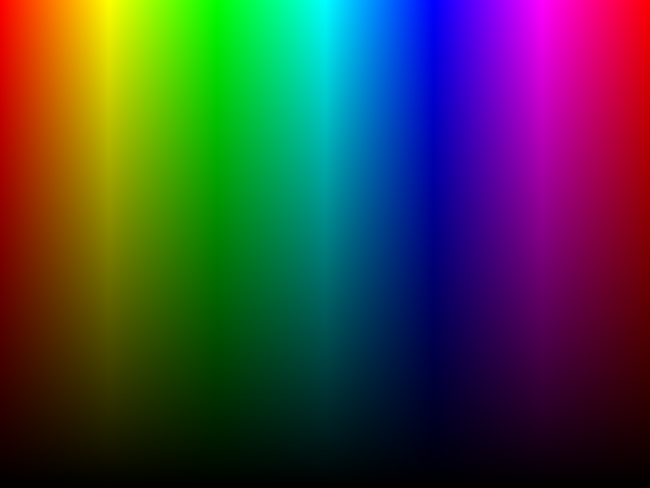

# Netpbm Study

I found a simple image format that I wanted to try and implement.

The examples and format is described on its 
[wiki page](https://en.wikipedia.org/wiki/Netpbm). There are a couple
of different modes refered to as `Magic Number` these being:
- `P1` Portable BitMap (Ascii) -> Black or White
- `P2` Portable GrayMap (Ascii) -> Greyscale
- `P3` Portable PixMap (Ascii) -> RGB
- `P4` Portable BitMap (Binary) -> Black or White
- `P5` Portable GrayMap (Binary) -> Greyscale
- `P6` Portable PixMap (Binary) -> RGB

> `P1`, `P2` and `P3` wot be supported as they are ascii derivatives
> and use more storage than it otherwise would.

Each of these modes have their own file format:
- Portable BitMap `.pbm`
- Portable GrayMap `.pgm`
- Portable PixMap `.ppm`

There is also an extension mode called `Portable Arbitrary Map (.pam)` 
which uses `P7` as the magic number. This mode allows a more dynamic
image types and can support all three previous modes as well as the 
addition of transparency by setting the `TUPLTYPE` value in the file.

More information on PAM [here](http://netpbm.sourceforge.net/doc/pam.html).

## Using this

I've created a single header file `netpbm.h` which will allow easy
implementation into projects. Due to the `HSV` support, compiling
with this header will require `-lm` added to your compile settings
as it uses `fmap` and `fabs` in the calculations.

The following lines of code is a full implementation of setting colours
for a buffer before creating an Portable PixMap (`out.ppm`). This file
can be opened in GIMP and Photoshop.

```c
#include <stdio.h>
#include "netpbm.h"

int main() {
    size_t width = 800, height = 600;
    float hue, saturation, value;
    
    /* Initialise a image buffer called `pixels` with width and height */
    INIT_PPM_BUF(pixels, width, height);

    /* Loop through every pixel in image */
    for (u32 y = 0; y < height; ++y) {
        for (u32 x = 0; x < width; ++x) {

            /* Precalc HSV values */
            hue = (x / (float)width) * 360.0f;
            saturation = 1.0f;
            value = 1.0f - (y / (float)height);

            /* Set pixel colour */
            pixels[y * width + x] = HSV888(hue, saturation, value);
        
        }
    }

    /* Write pixel buffer to image file */
    return construct_ppm_image("out.ppm", pixels, width, height);
}
``` 

Below is the image output from the code above:



> The image used to show on markdown is the result of opening the 
> image in GIMP and exporting it to `.png` so markdown can view it.
